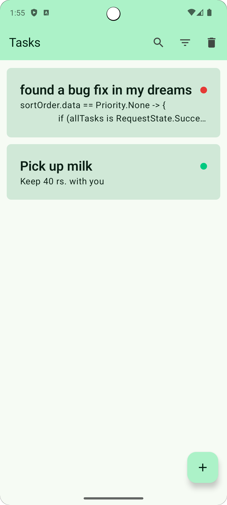
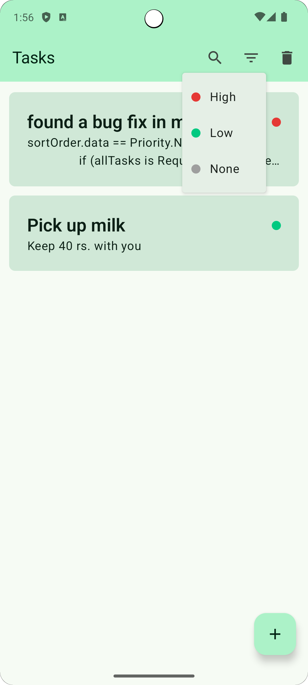
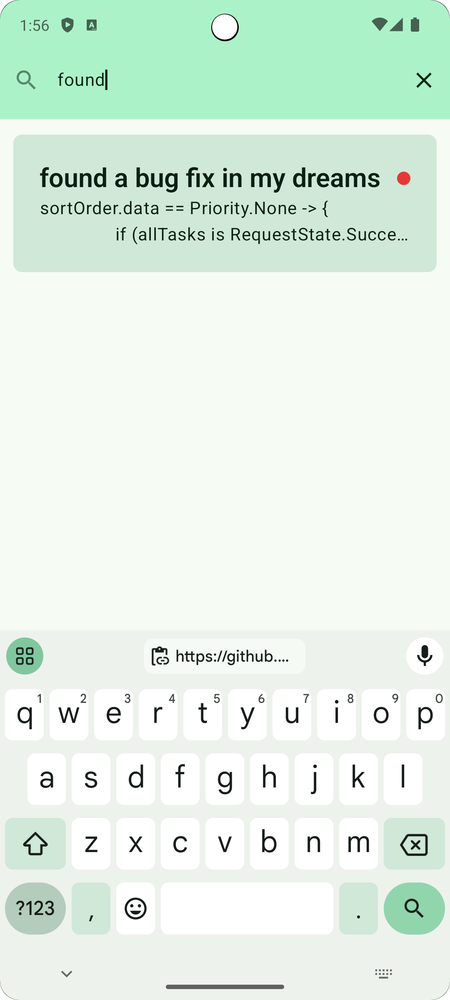
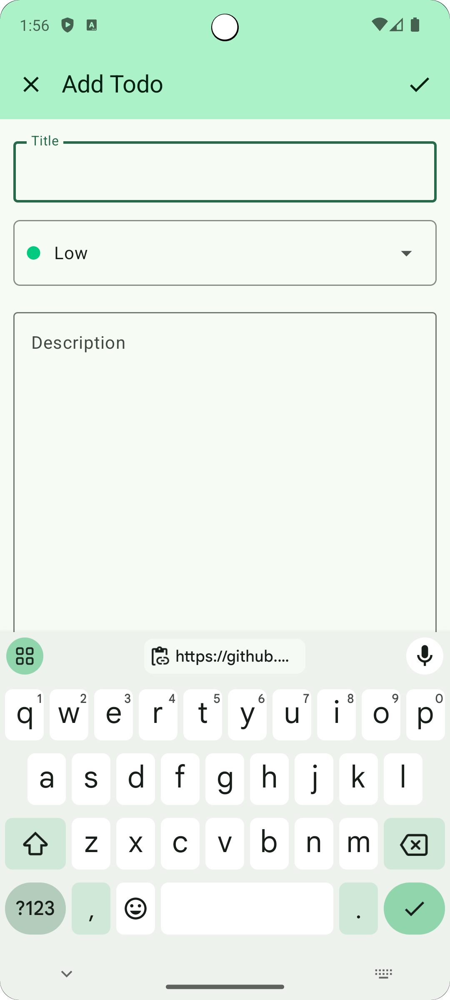

# JetToDo

JetToDo is a simple and intuitive To-Do application built using Jetpack Compose and Kotlin.

## Features

- Add, edit, and delete tasks
- Sort tasks by priority
- Beautiful UI using Jetpack Compose
- Persistent storage using Room database

## Screenshots

<!--suppress CheckImageSize -->
<p>

  
  
  
</p>

More screenshots can be found in the [screenshots](https://github.com/YuanziX/JetToDo/tree/master/screenshots) directory.

# Installation

To get a local copy up and running follow these simple steps.

### Prerequisites

- Android Studio (Always stick to the latest versions)
- Android SDK
- Kotlin (I used 2.0.0)

### Clone the repository

```sh
git clone https://github.com/YuanziX/JetToDo.git
```

### Open the project in Android Studio

1. Open Android Studio.
2. Select 'Open an existing project'.
3. Navigate to the directory where you cloned the repository.
4. Select the project directory.

### Run the app

1. Connect an Android device or start an emulator.
2. Click 'Run' in Android Studio.

## Contributing

Contributions are what make the open source community such an amazing place to learn, inspire, and create. Any contributions you make are **greatly appreciated**.

1. Fork the Project
2. Create your Feature Branch (`git checkout -b feature/AmazingFeature`)
3. Commit your Changes (`git commit -m 'Add some AmazingFeature'`)
4. Push to the Branch (`git push origin feature/AmazingFeature`)
5. Open a Pull Request

## License

Do whatever you want with the code. No restrictions.

## Contact

Achyut Badyal - [Your LinkedIn](https://www.linkedin.com/in/achyut-badyal-06402a275/)

Project Link: [https://github.com/YuanziX/JetToDo](https://github.com/YuanziX/JetToDo)